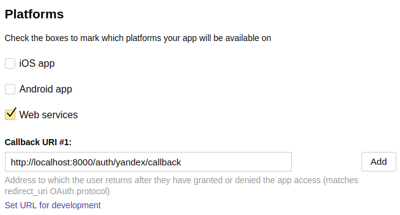
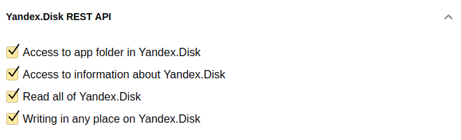

# Yandex OAuth 2.0 example

## OAuth application registration

1. Go to [Yandex OAuth](https://oauth.yandex.com/)
2. Click Register new client
3. Make sure to choose "Web services" as a target Platform and specify proper
callback URI

4. Make sure to grant "Yandex.Disk REST API" permissions (or choose whatever
you need)

5. Click "Create app"
6. Use "ID" and "Password" as Client ID and Client Secret for OAuth client

## Usage
1. Build & run example application
2. Open [localhost:8000/auth/yandex/login](http://localhost:8000/auth/yandex/login)
(or use whatever listen address you specified)


## Building
```bash
go build -o ./bin/yandex-oauth ./examples/00_oauth/main.go
```

## Running
```bash                    
./bin/yandex-oauth                                             \
    -listen=locahost:8000                                      \
    -client-id=YOUR-APPLICATION-CLIENT-ID                      \
    -client-secret=YOUR-APPLICATION-CLIENT-SECRET              \
    -callback-url="http://localhost:8000/auth/yandex/callback"
```
